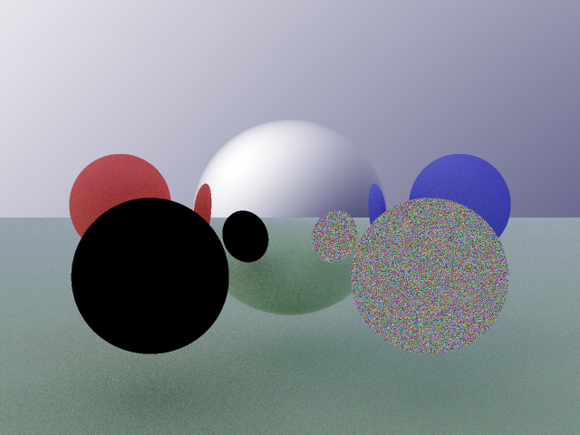

A ray tracer in Guile Scheme
============================

Following 'Ray Tracing in One Weekend' by Peter Shirley.

`hist` contains more renders captured over the development history.

Running `sh run.sh` will generate a render along with a profile of how
execution time was spent.
